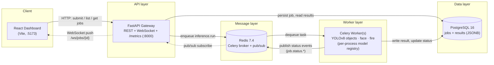

# Distributed CV Inference Service

A horizontally-scalable computer vision inference microservice: REST API in, Redis-queued Celery workers running real ML models, live status over WebSockets, Prometheus observability throughout.


## Architecture



Diagram source: [docs/architecture.mmd](docs/architecture.mmd).

## Tech Stack

| Layer | Tech |
|---|---|
| API | FastAPI 0.115 (async), Pydantic v2 |
| Data | PostgreSQL 16, SQLAlchemy 2.0 async, Alembic migrations |
| Queue | Celery 5.4 on Redis 7.4 (broker + pub/sub) |
| ML | ultralytics YOLOv8-nano (objects + face), torch |
| Real-time | FastAPI WebSockets + Redis pub/sub bridge |
| Observability | prometheus-client (multiprocess mode), structlog JSON logs |
| Frontend | React 18, Vite, Tailwind |
| Infra | Docker Compose, Locust load testing |

## Key Features

- **Async job lifecycle** — `POST` returns `202` immediately; jobs flow queued → processing → completed/failed on worker pools, with retryable failures backed off exponentially with jitter.
- **Three models, one interface** — YOLOv8 objects, YOLOv8-face, and a (placeholder) fire detector all implement `InferenceModel`; adding a model is one registry entry, task code untouched.
- **Per-process model caching** — models load once per worker process (lazy, fork-safe), not per task: no repeated 1-3 s cold starts.
- **Real-time updates without polling** — workers publish status to Redis pub/sub; a lifespan-managed subscriber in the API fans events out to WebSocket clients. Workers never know about sockets.
- **Two input modes** — public image URL or direct multipart upload (validated, size-capped, served back for display).
- **Production observability** — Prometheus counters/histograms aggregated across API *and* worker processes via multiprocess mode; structured JSON logs with `job_id` correlation end to end.

## Performance

Measured with the standardized [Locust](scripts/load_test.py) run ([scripts/run_benchmarks.sh](scripts/run_benchmarks.sh)): **50 concurrent users, spawn 5/s, 120 s**, 60/30/10 yolo/face/fire mix, against a single uvicorn process + a single `--pool=solo` worker on an M-series MacBook Air.

**API layer** (job submits + status reads):

| Metric | Value |
|---|---|
| Requests | 5,732 |
| Failures | **0** |
| Sustained throughput | **48.0 RPS** |
| p50 / p95 / p99 latency | **400 / 470 / 650 ms** |

**Worker inference** (Prometheus histogram, during the same run):

| Model | Mean inference | Notes |
|---|---|---|
| yolo | 81 ms | 95% of runs ≤ 100 ms warm |
| face | 39 ms | YOLOv8n-face (pretrained) |
| fire | 82 ms | YOLOv8 pass + label filter |

Single solo-pool worker completes **~45 jobs/min (≈0.75 jobs/s)** end-to-end — each job includes a network image download. Submission (48 RPS) intentionally outpaces one worker; capacity scales by adding worker replicas (`--concurrency=N` / more containers on Linux). Reproduce with `bash scripts/run_benchmarks.sh`.

## Local Development

```bash
docker compose -f infra/docker-compose.yml up -d     # postgres + redis
python3 -m venv .venv && source .venv/bin/activate
pip install -r requirements.txt
cp .env.example .env
alembic upgrade head
uvicorn api.main:app --reload --port 8000
celery -A workers.celery_app worker --loglevel=info --concurrency=2
```

> **Note:** the worker previously required `--pool=solo` on macOS, because
> Celery's default prefork pool SIGSEGV'd when MediaPipe initialized its native
> C++ threading in a forked child. Swapping face detection to YOLOv8 removed
> MediaPipe, and prefork now runs cleanly on macOS — use `--concurrency=N` for
> real parallelism on any platform. If you ever reintroduce a fork-unsafe native
> library, `--pool=solo` (or
> `OBJC_DISABLE_INITIALIZE_FORK_SAFETY=YES`) are the escape hatches.

**Frontend** (Vite proxies `/api` and `/ws` to :8000):

```bash
cd frontend && npm install && npm run dev   # → http://localhost:5173
```

**Metrics:** `curl http://localhost:8000/metrics`. Key series:
`cv_jobs_submitted_total`, `cv_jobs_completed_total`,
`cv_inference_duration_seconds` (histogram), `cv_websocket_connections`.
To aggregate worker metrics behind the API's `/metrics`, point both processes at
the same `PROMETHEUS_MULTIPROC_DIR`.

**Demo GIF:** `bash scripts/generate_demo.sh` prints the recording flow and the
ffmpeg/gifski recipe (output: `docs/demo.gif`).

## API Reference

| Endpoint | Description |
|---|---|
| `POST /api/v1/jobs` | Submit a job (JSON: `input_url`, `model_type`, `options`) → `202` + `job_id` |
| `POST /api/v1/jobs/upload` | Submit via multipart file upload (≤10 MB image) |
| `GET /api/v1/jobs/{id}` | Job status + nested result (detections, timings) |
| `GET /api/v1/jobs?status=&limit=&offset=` | Paginated job list, newest first |
| `GET /api/v1/jobs/{id}/image` | Serve an uploaded input image |
| `WS /ws/jobs/{id}` | Live `status_change` events for one job |
| `GET /health` · `GET /ready` | Liveness · readiness (checks Postgres) |
| `GET /metrics` | Prometheus exposition |

Interactive docs at `http://localhost:8000/docs`.

## Progress Tracker

- [x] Day 1: Project scaffolding, Docker Compose, health endpoints
- [x] Day 2: Async SQLAlchemy 2.0 data layer, Alembic migrations, readiness probes
- [x] Day 3: Jobs REST API (submit, get, list) with Pydantic v2 validation
- [x] Day 4: Celery worker wired for end-to-end job processing
- [x] Day 5: Real YOLOv8 inference — per-process model registry, image download/cleanup
- [x] Day 6: Three models behind the shared InferenceModel interface
- [x] Day 7: Multi-model routing via the model registry
- [x] Day 8-9: WebSocket real-time status via Redis pub/sub
- [x] Day 10-11: Prometheus multiprocess metrics + structured JSON logging
- [x] Day 12-13: React dashboard with real-time updates and SVG bounding-box overlays
- [x] Day 14: Locust load test, benchmarks, architecture diagram, README polish

## Design Decisions

| Choice | Why | Trade-off |
|---|---|---|
| Redis as Celery broker (not RabbitMQ/Kafka) | Lowest operational complexity; throughput far exceeds this workload; doubles as the pub/sub bus | No durable queues or dead-letter exchanges; migrate to RabbitMQ if delivery guarantees tighten |
| Sync SQLAlchemy in workers | Celery prefork is synchronous; asyncpg connections aren't fork-safe; plain `Session` code is simpler | Two engines (async API, sync worker) to keep consistent |
| Per-process model registry (lazy) | Models load once per worker process, only for types actually used; fork-safe by construction | First task per process pays the cold start; no cross-process sharing |
| Offset pagination | Simple, stateless, fits a dashboard scanning recent jobs | Deep pages scan more rows; cursor pagination is the upgrade path |
| Detections as JSONB (not a detections table) | Reads dominate; queries are always "all detections for a job" — no joins | Can't index/query individual detections efficiently |
| Fire-and-forget status publish | A Redis blip must never fail an inference job; UI state is reconstructable from the DB | A dropped event means a client may briefly show stale status (poll reconciles) |
| YOLOv8-face over MediaPipe BlazeFace | Handles angled/multiple faces, returns true pixel boxes, and reuses the existing ultralytics path | ~39 ms vs BlazeFace's ~5 ms per image |

## What's Not Included

Honest limitations of the current iteration:

- **No authentication or rate limiting** — every endpoint is open; fine for a demo, a blocker for production.
- **No multi-tenant isolation** — all jobs share one namespace and one queue.
- **Single-node deployment** — one Docker Compose host; no k8s manifests, no HA Postgres/Redis.
- **Python-side model registry** — model routing lives in worker code, not infrastructure (no per-model autoscaling as you'd get from k8s/KServe).
- **Fire detection is a flagged placeholder** — base YOLOv8 weights + label filter (`model_version: yolov8n-fire-placeholder-v1`); a real fire model swaps in with zero code changes.
- **No retention/GC** — uploaded images and old job rows accumulate until cleaned manually.
